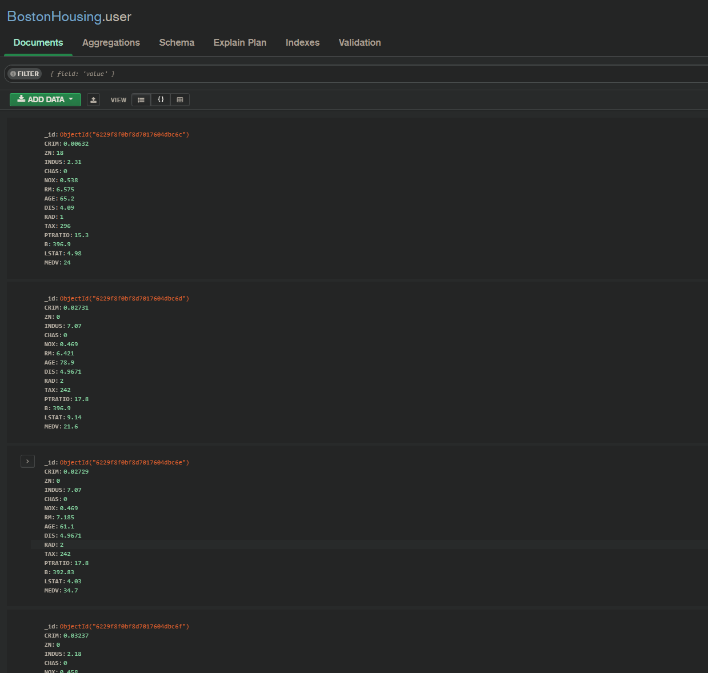
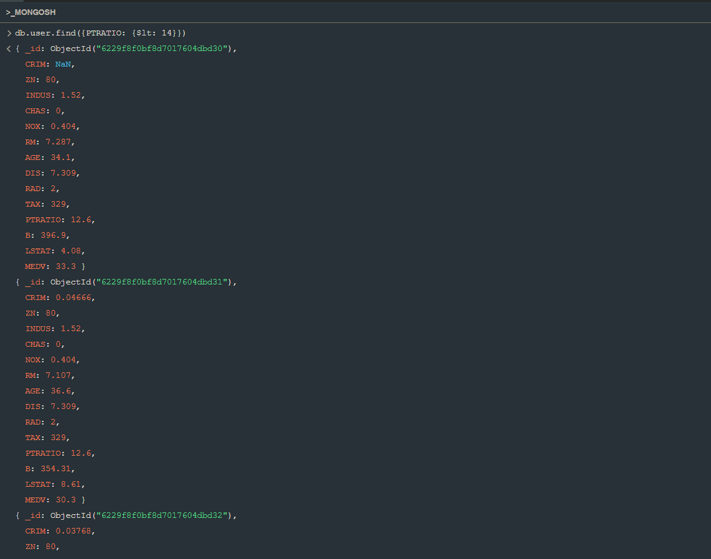
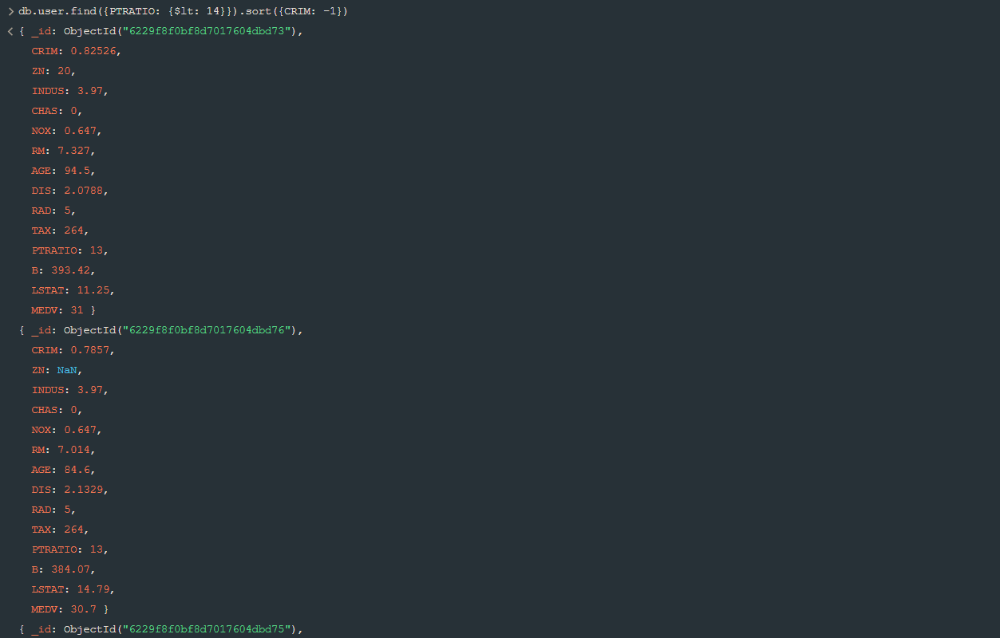
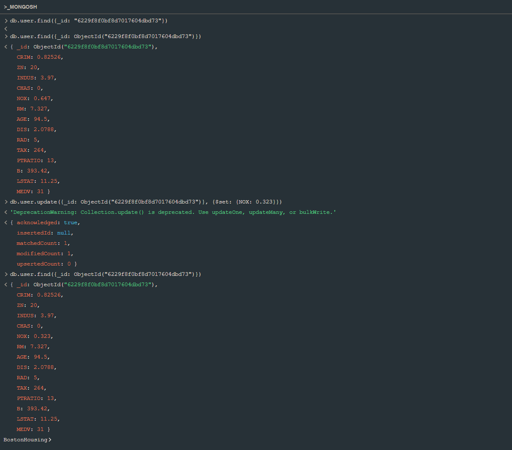
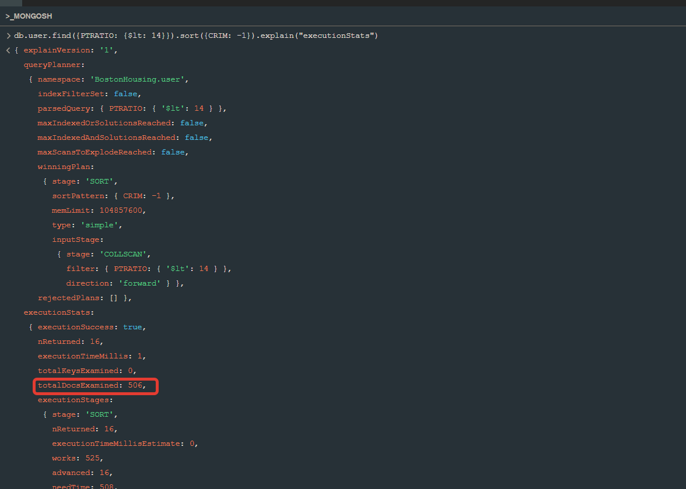
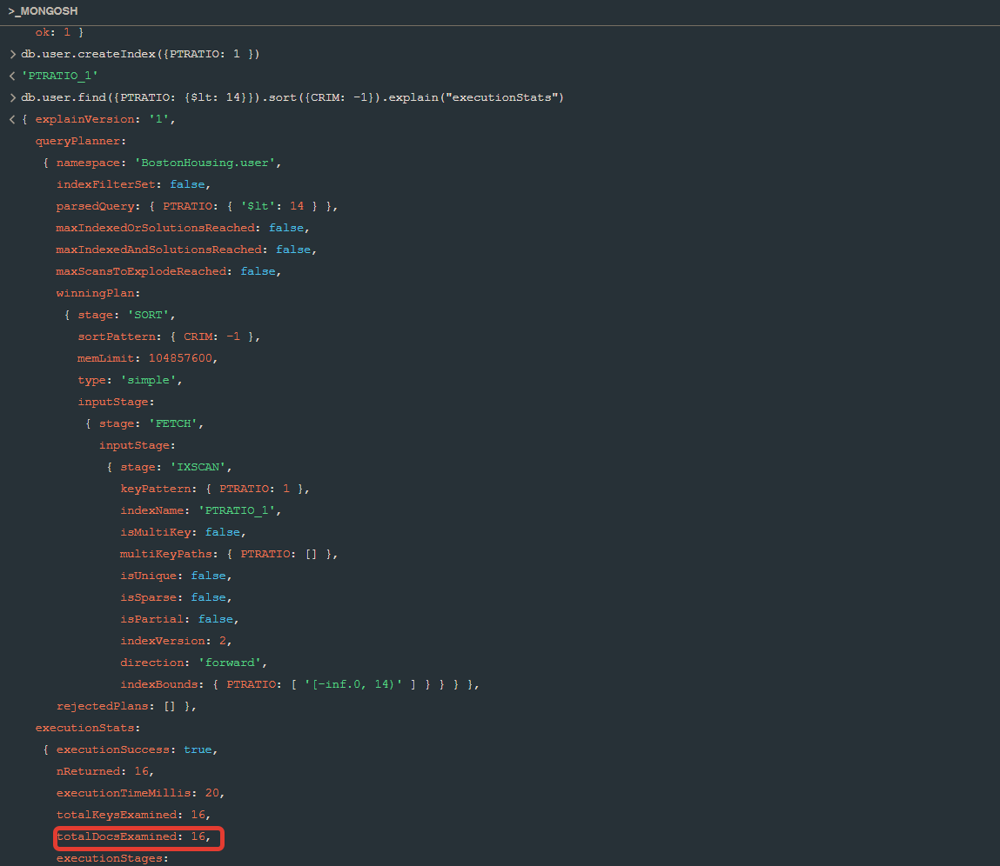

# Дом в Бостоне

Как и положено специалисту по MongoDB, я заработал много денег, и теперь я хочу потратить их на покупку дома в Америке. Я собираюсь проанализировать данные о качестве и стоимости жилья в разных районах города Бостона, используя датасет Boston Housing.

Я хочу дать своим детям качественное образование, поэтому ище район с хорошей школой, в которой __на одного учителя приходится не слишком много детей__.
  

 

Кроме того, мне важно, чтобы дети были всесторонне развиты и помимо классического образования прошли настоящую школу жизни, поэтому я хотел бы в первую очередь рассмотреть районы с __высоким уровнем преступности__.

 

Кажется я нашел подходящий район. Когда я перееду туда, я обязателно разобью сад на преусадебном участке, что благотворно повлияет на экологию, поэтому нужно __обновить данные о качестве воздуха__.

## Индекс
Основное поле, по которому я осуществляю поиск -- PTRATIO, по нему и имеет смысл создавать индекс. Сейчас выполнение запроса требует исследования 506 документов.

 

А после создания индекса -- всего 16.

