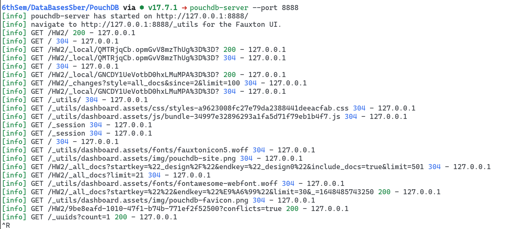
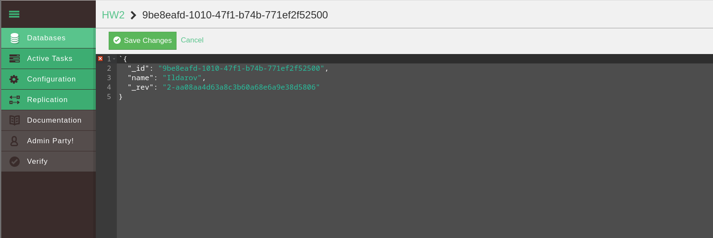
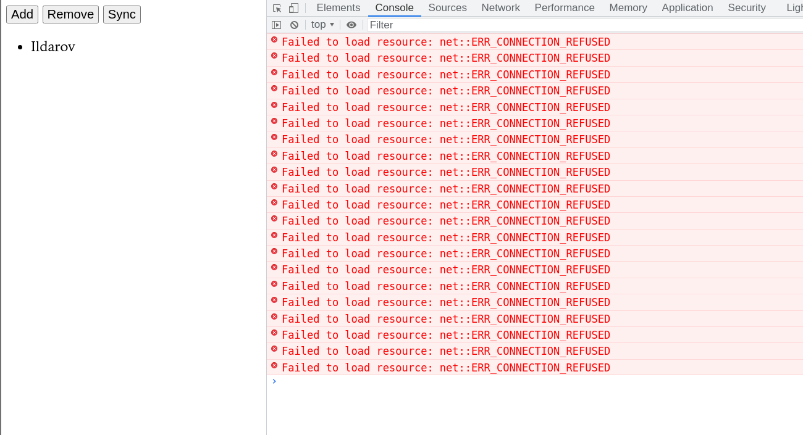

# PouchDB

Я решил использовать pouch-db server.

 

Создал базу данных с полем name.

 

Проверил, что после синхронезации изменения видны в html файле из задания.

 

И убедился, что изменения остаются после отключения сервера (ошибки в консоли -- из-за невозможности подключиться к выключенному серверу).

[Html файл с кнопками тут](PouchDB.html)
