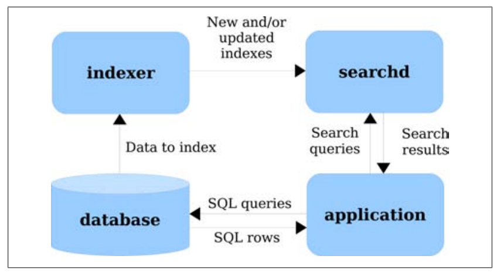
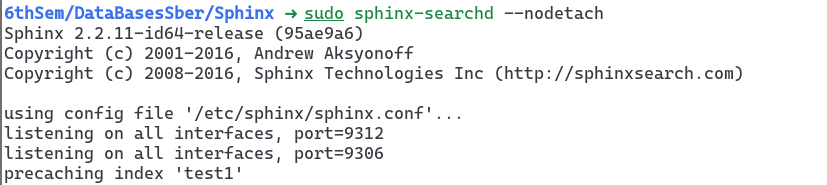

# Sphinx — система полнотекстового поиска


## История и развитие
Выпущена в 2001 году американской компанией Sphinx Technologies Inc. Основной вклад в разработку внес Андрей Аксёнов. Написана на языке C++. Сейчас используется для поиска в Habrahabr, Craiglist и Викимапия. Проект не мертв, последняя версия вышла в 2021 году, но уже не пользуется популярностью. Гораздо активнее развивается его форк — Manticore Search.

## Как устроен полнотекстовый поиск в Sphinx
У нас есть общая и очень распространенная задача — уметь производить поиск по неструктурированному тексту. Самый очевидный способ — просмотреть весь объем данных — неэффективен. 

Можно вспомнить, что изданные в доэлектронные времена технические книги всегда имели в конце предметный указатель — список ключевых слов и страниц, где они упомянуты. 

### Индексация
Так вот, для оптимизации поиска Sphinx строит такой же предметный указатель, который называется __Full-text Index__ и работает он по тому же принципу: для каждого заданного ключевого слова ведется отсортированный список идентификаторов документов и позиций в них, который используется для быстрого поиска. Такой формат индекса называется _inverted file_.

Индексы также могут содержать дополнительные данные для каждого ключевого слова, такие как морфологическая информацию (корень слова для нечеткого поиска), или контекст ключевого слова (размер шрифта). Такие данные используются для улучшения _ранжирования по релевантности_.

Индекс в зависимости от особенностей работы нашего приложения можно хранить в RAM, на диске или даже в БД. 

#### Обновление индекса
Древнегреческий философ Гераклит учил нас, что всё течёт и ничто не остаётся на месте. Поэтому для разных моделей обновления данных Sphinx позволяет выбрать разные форматы индекса: либо c возможностью последовательных частичных обновлений — _incremental updates_, но медленне работающий, либо более оптимизированный, но неизменяемый после создания.

#### Восстановление данных из индекса
Sphinx позволяет генерировать индекс, из которого потом можно будет восстановить исходные данные, одна это не оптимальный по скорости работы вариант индексирования.

### Сортировка по релевантности
Результат поиска для нас это не просто набор подходящих документов, мы хотим чтобы он также был отсортирован в _правильно порядке_. Для определения этого правильного порядка мы вводим функцию релевантности, которая показывает насколько конкретный документ соотвествует конкретному запросу.

По умолчанию в Sphinx используется метрика BM25, расчитываемая следующим образом:


Основная идея в том, чтобы ранжировать документ выше, если он содержит редкие ключевые слова и если он имеет много вхождений ключевых слов.

## Workflow
В готовом приложении, использующем Sphinx мы имеем 4 основных компонента:
* Client — получает от пользователя или генерирует запрос, который отправляет _searchd_, поисковому сервису Sphinx.

* Data Source — источник данных, по которым осуществляется поиск. На практике это чаще всего SQL база данных, но Sphinx не накладывает ограничений.

* indexer — сервис Sphinx, который строит Full-text Index входных данных.

* searchd — сервис Sphinx, который осуществляет поиск при помощи Full-text Index.
Эти компоненты взаимодействуют так как показано на схеме:



### Пример работы
Сначала необходимо задать Data Source в файле /etc/sphinx/sphinx. conf:
```
source src1
{
	# data source type. mandatory, no default value
	# known types are mysql, pgsql, mssql, xmlpipe, xmlpipe2, odbc
	type			= pgsql

	#####################################################################
	## SQL settings (for ’mysql’ and ’pgsql’ types)
	#####################################################################

	# some straightforward parameters for SQL source types
	sql_host		= localhost
	sql_user		= postgres 
	sql_pass		=
	sql_db			= test
	sql_port		= 3306	# optional, default is 3306...

```

Создадим базу данных для примера


Затем создим индекс
```
$ sphinx-indexer test1

Sphinx 2.2.11-id64-release (95ae9a6)
Copyright © 2001-2016, Andrew Aksyonoff
Copyright © 2008-2016, Sphinx Technologies Inc (http://sphinxsearch. com)
using config file ’/etc/sphinx/sphinx. conf’...
indexing index ’test1′...
collected 4 docs, 0.0 MB
sorted 0.0 Mhits, 100.0% done
total 4 docs, 193 bytes
total 0.007 sec, 24683 bytes/sec, 511.57 docs/sec
total 3 reads, 0.000 sec, 0.1 kb/call avg, 0.0 msec/call avg
total 9 writes, 0.000 sec, 0.1 kb/call avg, 0.0 msec/call avg
```

И запустим сервис поиска

```
$ sphinx-searchd —nodetach

Sphinx 2.2.11-id64-release (95ae9a6)
Copyright © 2001-2016, Andrew Aksyonoff
Copyright © 2008-2016, Sphinx Technologies Inc (http://sphinxsearch. com)

using config file ’/etc/sphinx/sphinx. conf’...
listening on all interfaces, port=9312
listening on all interfaces, port=9306
precaching index ’test1′
```

Сделаем поисковый запрос при помощи стандартного клиента:
```
$ php test. php test

Query ’test ’ retrieved 3 of 3 matches in 0.000 sec.
Query stats:
’test’ found 5 times in 3 documents
Matches:
1. doc_id=1, weight=101, group_id=1, date_added=2010-09-06 03:27:05
2. doc_id=2, weight=101, group_id=1, date_added=2010-09-06 03:27:05
3. doc_id=4, weight=1, group_id=2, date_added=2010-09-06 03:27:05
```

### Формат поискового запроса
Поисковый запрос выглядит примерно так же как запрос в Google, Sphinx поддерживает некоторое подобие регулярных выражений и логические операторы. Есть например оператор MAYBE: `one MAYBE two` — Искать 1-й аргумент, но учитывать 2-й аргумент при ранжировании.

Если запрос к searchd производится из СУБД, то нужно испольозовать специальную функцию MATCH:
```
SELECT * FROM test1 WHERE MATCH(’one MAYBE two’);
```

## Отличия системы полнотекстового поиска от СУБД
Главное отличие в том, что Sphinx работает с неструктурированными данными. Кроме того, система оптимизирована для того, чтобы индексировать и быстро находить текстовые совпадения. Также важно, что в отличие от СУБД, Sphinx умеет сортировать результаты поиска по релевантности.

В силу этих отличий, нельзя говорить о таких понятиях как __Data Mining, Data Warehousing и OLAP__ в контексте Sphinx.

## Докумментация и информация о проекте.
Доки и форум доступны на [официальном сайте](http://sphinxsearch.com/docs/), там же можно присоидениться к почтовой рассылки чтобы __быть в курсе__ процесса разработки.

Несмотря на то, что Sphinx это продукт с открытым исходным кодом, последняя версия распространяется по коммерческой лицензии, ее исходный код доступен только по запросу и __поучаствовать в разработке__ нельзя.
